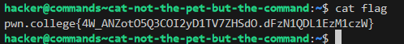

# cat: not the pet, but the command!
1) OBJECTIVE- Read the contents of the file flag.
2) SOLUTION- Use the cat command and provide the relative path for flag file as an argument to it.

&nbsp;

&nbsp;

### EXPLANATION
he contents of the file supplied to the cat command as an argument to the shell are read. The relative path to the flag file is the argument in this instance.

---
&nbsp;
# catting absolute paths
1) OBJECTIVE- Read the contents of the file flag.
2) SOLUTION- Use the cat command and provide the relative path for flag file as an argument to it.

&nbsp;

&nbsp;

### EXPLANATION
he contents of the file supplied to the cat command as an argument to the shell are read. The relative path to the flag file is the argument in this instance.

---
&nbsp;
# grepping for a needle in a haystack
1) OBJECTIVE- Read a specific line from the file data.txt
2) SOLUTION- use grep command.

&nbsp;

&nbsp;

### EXPLANATION
grep command can be used to search for a line containing specified set of strings. In this case the data.txt file has a lot of lines which can be quite difficult to skim through to find the flag if only the cat command is used to read it. Instead grep can be used to find a line containing "pwn.college" in the text file.

---
&nbsp;
# listing files
1) OBJECTIVE- Find the modified /challenge/run file.
2) SOLUTION- use ls to list all the files.
&nbsp;

&nbsp;

### EXPLANATION
ls is used to list all the files inside the /challenge directory. Then the renamed run file is executed to get the flag.

---
&nbsp;
# touching files
1) OBJECTIVE-  Create files in the /tmp directory
2) SOLUTION- Use the cat command and provide the relative path for flag file as an argument to it.

&nbsp;

&nbsp;

### EXPLANATION
he contents of the file supplied to the cat command as an argument to the shell are read. The relative path to the flag file is the argument in this instance.

---
&nbsp;
# removing files
1) OBJECTIVE- Delete a file in /home directory
2) SOLUTION- use rm command
&nbsp;

&nbsp;

### EXPLANATION
provide the name of the file i.e delete_me to the rm command as an argument. This deletes the file. Then execute /challenge/check to get the flag.

---
&nbsp;
# hidden files
1) OBJECTIVE-  Find the hidden file in the / directory.
2) SOLUTION-use ls with -a flag.

&nbsp;

&nbsp;

### EXPLANATION
he contents of the file supplied to the cat command as an argument to the shell are read. The relative path to the flag file is the argument in this instance.

---
&nbsp;
# An Epic File System Quest
1) OBJECTIVE- Find the flag
2) SOLUTION- Use cd ls cat commands
&nbsp;

.png)
.png)
.png)
.png)
.png)
.pngv)
.png)

&nbsp;

---
&nbsp;
# making directories
1) OBJECTIVE- Create directories
2) SOLUTION-Use mkdir command

&nbsp;

&nbsp;

### EXPLANATION
cd into the root directory. Then use mkdir /tmp/pwn, this command creates a tmp directory and then creates a pwn directory inside the tmp directory. Use touch college to create a file. Then run /challenge/run.

---
&nbsp;
# removing files
1) OBJECTIVE- Read the contents of the file flag.
2) SOLUTION- Use the cat command and provide the relative path for flag file as an argument to it.

&nbsp;

&nbsp;

### EXPLANATION
he contents of the file supplied to the cat command as an argument to the shell are read. The relative path to the flag file is the argument in this instance.

---
&nbsp;